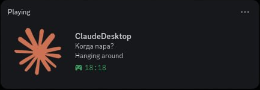

# claude-desktop-presence

**Карточка Discord для Claude Desktop на Linux.** Показывает, какой чат открыт и чем Claude занят, а вместо скучного «думает» пишет пасхалки из песен, игр и книг.

   

*[English version](README.en.md)*



---

> ### Прочитайте до установки
>
> | | |
> |---|---|
> | проверено каждый день | Fedora 44, Hyprland 0.56, Claude Desktop (неофициальная сборка для Linux 2.9939), Discord 1.0.160 |
> | только написано | пути к сокету Discord из Flatpak, Snap и Vesktop; ожидание разрешения на команду |
> | не поддерживается | macOS, Windows, Claude Code в терминале без Desktop |
>
> **Код писал ИИ:** Claude, по задачам автора и с его правками. [Подробнее](#написано-вместе-с-ии).
>
> Скрипт читает внутренние файлы Claude Desktop и Claude Code. Это не публичный интерфейс, и обновление может их поменять.

---

[Зачем это](#зачем-это) · [Установка](#установка) · [Настройка](#настройка) · [Пасхалки](#пасхалки) · [Приватность](#приватность) · [Как устроено](#как-устроено) · [Обновление и удаление](#обновление-и-удаление)

---

## Зачем это

Сам по себе Discord Claude не показывает. На Linux его можно добавить вручную как игру, но карточка будет пустой, с вопросительным знаком. Эта программа делает её живой:

- **первая строка:** открытый чат, а если чат не выбран, «Главное меню»;
- **вторая строка:** что делает Claude: думает, правит файлы, задал вопрос, ждёт разрешения, ответил, ждёт тебя, упёрся в ошибку или сжимает контекст. У каждого состояния свои фразы, большая часть из них пасхалки;
- **время:** сколько открыт Claude Desktop.

Модели, токенов и лимитов здесь нет специально. Если нужны они, есть [rar-file/claude-rpc](https://github.com/rar-file/claude-rpc) и [BrunoJurkovic/claude-code-discord-status](https://github.com/BrunoJurkovic/claude-code-discord-status), но они для Claude Code, а не для Desktop.

Это один файл на Python без сторонних библиотек и служба systemd. В интернет не ходит, файлы Claude только читает.

**Чего не умеет:** работает только с Claude Desktop; у облачных чатов нет состояния, только название «Облачная сессия»; сжатие контекста видно только с хуком (его ставит установщик).

---

## Установка

Нужны Linux с systemd, Python 3.11 или новее, Claude Desktop и Discord (обычный, Flatpak, Snap или Vesktop).

1. Создай приложение на [discord.com/developers/applications](https://discord.com/developers/applications). Его имя Discord покажет после «Играет в». Имя «Claude» занято, подойдёт, например, «ClaudeDesktop».
2. В разделе Rich Presence → Art Assets загрузи картинку 1024×1024 с ключом `claude`. Скопируй Application ID со страницы General Information.
3. Скачай и установи:
   ```bash
   git clone https://github.com/tomon-one/claude-desktop-presence ~/claude-desktop-presence
   cd ~/claude-desktop-presence
   ./install.sh
   ```
4. Впиши Application ID в `~/.config/claude-desktop-presence/config.toml` и запусти службу:
   ```bash
   systemctl --user enable --now claude-desktop-presence
   ```
5. Если раньше добавлял `claude` в Discord вручную, удали его в настройках Discord, раздел «Зарегистрированные игры», иначе карточек будет две.

Установщик добавляет в `~/.claude/settings.json` хук `PreCompact`: пока Claude сжимает контекст, он ничего не пишет в журнал, и без хука это состояние не увидеть. Хук только оставляет пустой файл-метку. Без него: `./install.sh --no-hook`, по-английски: `./install.sh --lang en`.

---

## Настройка

Всё лежит в `~/.config/claude-desktop-presence/`: `config.toml` с настройками, `words.txt` с фразами (перечитывается на лету) и `hide.txt` со скрытыми чатами.

Необязательное в `config.toml`:

| настройка | что делает |
|---|---|
| `status_display = "state"` | в списке участников сервера под ником будет фраза, а не имя приложения |
| `state_icons = true` | значок состояния в углу картинки. Значки лежат в [docs/icons](docs/icons), загрузи их в Art Assets с ключами по именам файлов |
| `buttons` | до двух кнопок со ссылками, их видят другие, но не ты |

После правки `config.toml`: `systemctl --user restart claude-desktop-presence`. Лог: `journalctl --user -u claude-desktop-presence -f`.

---

## Пасхалки

Фразы лежат в `words.txt` по разделам, по одной в строке. Условие пишется после `@`, например `Wake up, Samurai @дольше 30`. Фраза меняется раз в 30 секунд и при каждой смене состояния.

| условие | когда показывается |
|---|---|
| без условия | всегда, вперемешку с остальными |
| `@ночь` | с 23:00 до 5:00, вперемешку с остальными |
| `@03:45` | только в эту минуту, вместо остальных |
| `@дольше 30` | состояние длится больше 30 минут. Чередуется с обычными фразами, из нескольких порогов берётся больший |
| `@утро` | первое ожидание за утро, с 5 до 12. Чередуется с обычными фразами |
| `@шанс 25` | с вероятностью 25 % при входе в состояние. Чередуется с обычными фразами |
| `@запуск` | только в разделе `[событие]`: первая минута после запуска Claude Desktop |
| `@переключение 15` | только в разделе `[событие]`: с вероятностью 15 % при смене чата, на минуту |

Ниже набор по умолчанию, `words/ru.txt`. Английская версия лежит в `words/en.txt`. Названия разделов и условий понимаются на обоих языках.

**Думает**

| фраза | когда | отсылка |
|---|---|---|
| Думает | всегда | |
| Генерирует | всегда | |
| Seems hard | всегда | The Cardigans, песня «Seems Hard» (альбом Emmerdale) |
| I figured out | всегда | The Cardigans, песня «I Figured Out» (The Other Side of the Moon) |
| Делит на части | всегда | The Cardigans, песня «Great Divide» (First Band on the Moon) |
| Становится человеком | всегда | игра Detroit: Become Human |
| Нестабильность ПО ▲ | всегда | Detroit: Become Human, индикатор программы Коннора |
| Ищет свет во тьме | всегда | игра The Last of Us, девиз Цикад |
| Копает прямо вниз | всегда | Minecraft, главное правило «не копай прямо вниз» |
| Ищет бензин | всегда | игра Days Gone, вечно пустой бак байка |
| Long gone before daylight | ночью | The Cardigans, альбом «Long Gone Before Daylight» |
| 03:45: No Sleep | в 03:45 | The Cardigans, песня «03:45: No Sleep» (Long Gone Before Daylight) |
| Overloaded | дольше 5 минут | The Cardigans, песня «Overload» (Super Extra Gravity) |
| Киберпсихоз подкрадывается | дольше 15 минут | игра Cyberpunk 2077 |

**Правит файлы**

| фраза | когда | отсылка |
|---|---|---|
| Ведёт расследование, как Ковач | всегда | Ричард Морган, роман «Видоизменённый углерод», Такеси Ковач |
| Push B non stop | всегда | Counter-Strike 2, раш на точку B |

**Задал вопрос с вариантами**

| фраза | когда | отсылка |
|---|---|---|
| Красная или синяя таблетка? | всегда | фильм «Матрица» |

**Ждёт разрешения на команду**

| фраза | когда | отсылка |
|---|---|---|
| Do you believe? | всегда | The Cardigans, песня «Do You Believe» (Gran Turismo) |
| If there is a chance | всегда | The Cardigans, песня «If There Is a Chance» (Long Gone Before Daylight) |
| Просит дроп | всегда | Counter-Strike 2, просьба скинуть оружие |
| Ждёт приказа | всегда | Detroit: Become Human, андроиды ждут указаний |

**Только что ответил** (30 секунд после ответа)

| фраза | когда | отсылка |
|---|---|---|
| Готово | всегда | |
| Breathtaking | с вероятностью 25 % | Киану Ривз на E3 2019: «You're breathtaking!» |

**Ждёт**

| фраза | когда | отсылка |
|---|---|---|
| Ждёт ответа | всегда | |
| Hanging around | всегда | The Cardigans, песня «Hanging Around» (Gran Turismo) |
| Never fade away | всегда | Cyberpunk 2077, песня SAMURAI «Never Fade Away» |
| Ты здесь? Подай знак | всегда | игра Phasmophobia, вопрос к призраку |
| Отель «Хендрикс» ждёт гостей | всегда | «Видоизменённый углерод», отель с ИИ |
| Night City | ночью | Cyberpunk 2077, Найт-Сити |
| Хочет на Луну | ночью | аниме Cyberpunk: Edgerunners, мечта Люси |
| Ждёт 5:08, ничего не нажимая | в 05:08 | Cyberpunk 2077, секретная концовка |
| Wake up, Samurai | дольше 30 минут | Cyberpunk 2077, Джонни Сильверхенд |
| Ждёт, как Вайс-Сити ждёт GTA VI | дольше часа | GTA VI, возвращение в Вайс-Сити |
| Rise & shine | первое ожидание за утро | The Cardigans, песня «Rise & Shine» (Emmerdale) |

**Чат не выбран**

| фраза | когда | отсылка |
|---|---|---|
| Сидит в лобби | всегда | |
| Press any key | всегда | |
| Ждёт второго игрока | всегда | |
| Бродит по Найт-Сити | ночью | Cyberpunk 2077 |

**Событие** (на минуту поверх любого состояния)

| фраза | когда | отсылка |
|---|---|---|
| Ready or not? | первая минута после запуска Claude Desktop | Cascada, песня «Ready or Not» (Evacuate the Dancefloor), и игра Ready or Not |
| Ready or not? | с вероятностью 15 % при смене чата | то же |

**Ошибка**

| фраза | когда | отсылка |
|---|---|---|
| Чёрный день | всегда | The Cardigans, песня «Black Letter Day» (Emmerdale) |
| Wasted | всегда | серия GTA, экран смерти |
| Never Recover | всегда | The Cardigans, песня «Never Recover» (First Band on the Moon) |

**Сжимает контекст**

| фраза | когда | отсылка |
|---|---|---|
| Сжимается, но не сдаётся | всегда | The Cardigans, «Never Recover» наоборот |
| Новая оболочка, стек цел | всегда | «Видоизменённый углерод»: тело меняется, сознание в стеке остаётся |
| Эко-раунд, копит на AWP | всегда | Counter-Strike 2 |
| Erase/Rewind | всегда | The Cardigans, песня «Erase/Rewind» (Gran Turismo) |

---

## Приватность

Карточку видят друзья и участники общих серверов, а значит, и названия чатов. Чтобы скрыть чат, впиши в `hide.txt` часть его названия, по одной на строку:

```
# ~/.config/claude-desktop-presence/hide.txt
Личное
Резюме
```

Чаты «Личное: планы» и «Резюме для работы» в карточке станут «Приватная сессия». Регистр не важен, перезапуск не нужен. Отключить активность для отдельного сервера можно в Discord: «Конфиденциальность активности». В лог службы названия чатов не пишутся.

---

## Как устроено

- **Открытый чат** берётся из лога Desktop `~/.config/Claude/logs/main.log` (строки `setFocusedSession`), названия из `~/.config/Claude/claude-code-sessions/`.
- **Состояние** берётся из конца журнала сессии `~/.claude/projects/*/<id>.jsonl` и служебного файла Claude Code `~/.claude/sessions/<pid>.json`, где видно ожидание разрешения.
- **В Discord** карточка уходит через локальный сокет `discord-ipc`, только при изменениях. Опрос раз в 4 секунды.

---

## Обновление и удаление

Обновить: зайти в папку, куда скачивал, и запустить установщик заново.

```bash
cd ~/claude-desktop-presence
git pull
./install.sh
```

Свой `words.txt` установщик не перезаписывает, новые фразы видны командой `diff words/ru.txt ~/.config/claude-desktop-presence/words.txt`. Удалить: `./install.sh --uninstall` (службу, скрипт и хук; настройки остаются).

---

## Написано вместе с ИИ

Код, проверки и README написал Claude в Claude Code. Автор, [tomon-one](https://github.com/tomon-one), придумал, что показывать, сочинил пасхалки и проверял всё на своём Discord. Перед публикацией код прошёл аудит независимыми агентами, найденное исправлено. 41 автоматическая проверка работает на искусственных журналах и поддельном Discord: `python3 -m unittest discover -s tests`.

---

## Лицензия

[MIT](LICENSE). Значки состояний сделаны из [Material Design Icons](https://github.com/Templarian/MaterialDesign) (Apache 2.0). Неофициальный проект, с Anthropic не связан. Claude и Anthropic являются товарными знаками Anthropic, PBC.
